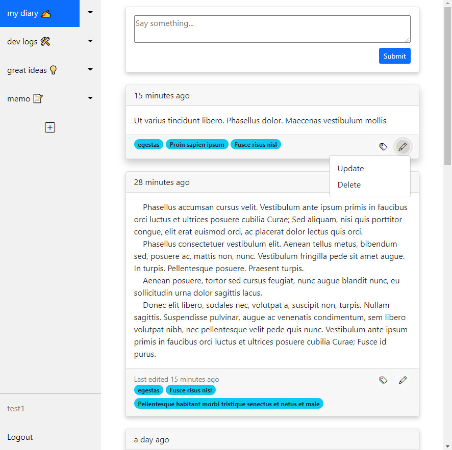
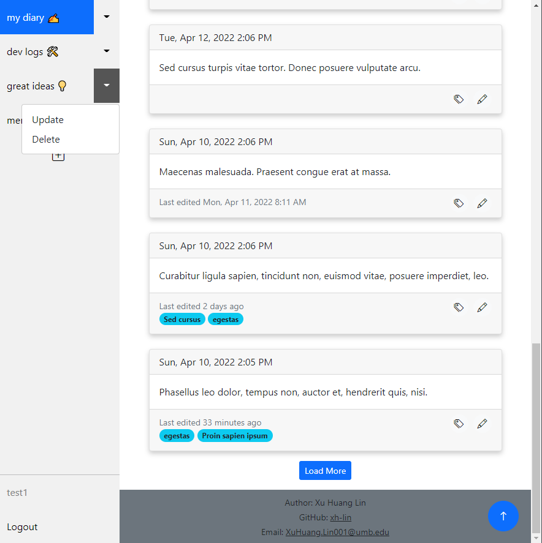
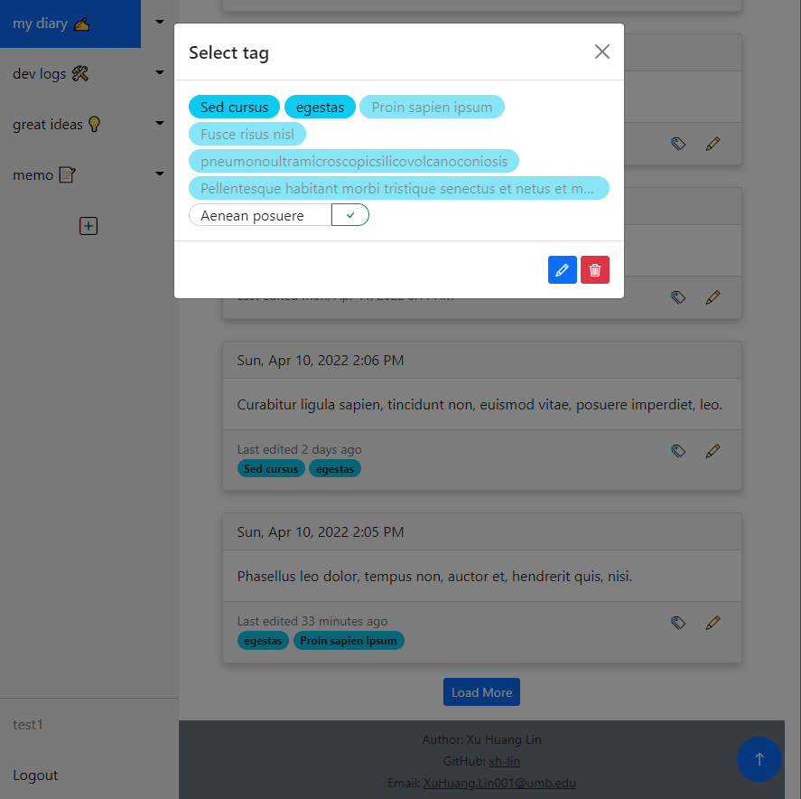
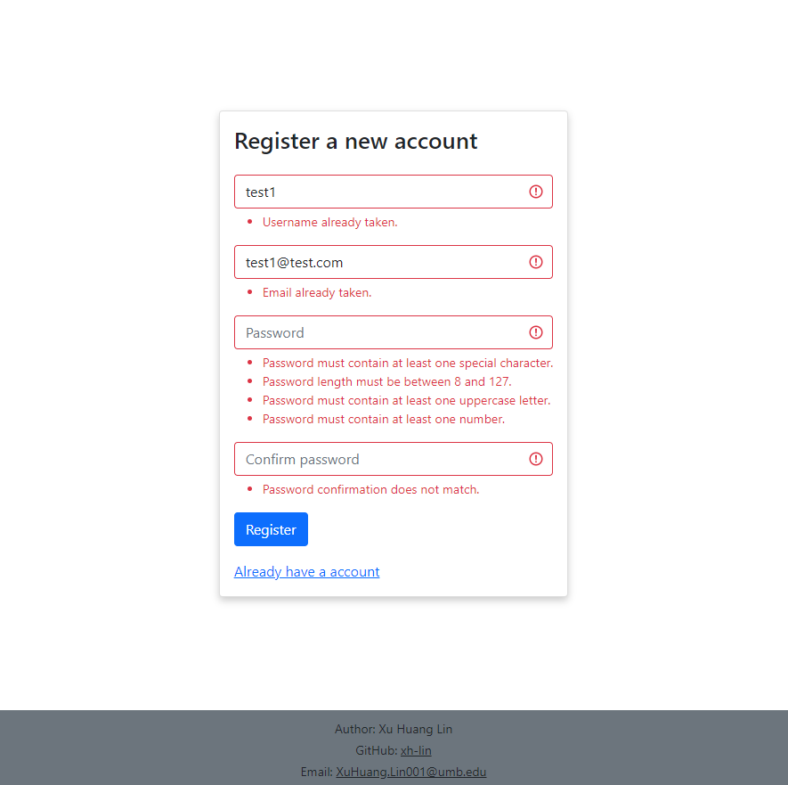

# diary

- This is a web app that you can write things down.
- A demo project for Spring Boot.

### Demo Link

- https://diary-qa.up.railway.app
- If you wish to try the site but it's down. Please contact me.
- Data stored isn't secure and will be deleted irregularly.
- The app is deployed using [Railway](https://railway.app), and the DB is hosted on [db4free](https://www.db4free.net).

## Preview

## Spring Initializr

https://start.spring.io/#!type=maven-project&language=java&platformVersion=2.6.6&packaging=jar&jvmVersion=11&groupId=com.xuhuang&artifactId=diary&name=diary&description=Demo%20project%20for%20Spring%20Boot&packageName=com.xuhuang.diary&dependencies=web,thymeleaf,security,mariadb,data-jpa,lombok,validation,devtools

## Env variables need to be set

DIARY_ACTIVE_PROFILE="dev" # dev / qa 

DIARY_DEV_HOST="localhost" 
DIARY_DEV_PORT="3306" 
DIARY_DEV_DB="diarydev" 
DIARY_DEV_USERNAME="root" 
DIARY_DEV_PASSWORD="root" 

DIARY_QA_HOST=... 
DIARY_QA_PORT=... 
DIARY_QA_DB=... 
DIARY_QA_USERNAME=... 
DIARY_QA_PASSWORD=... 
